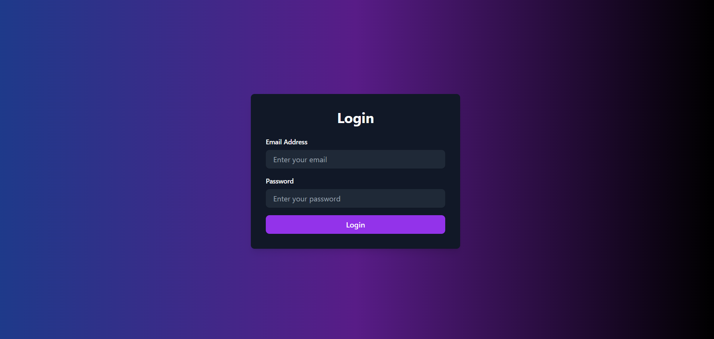
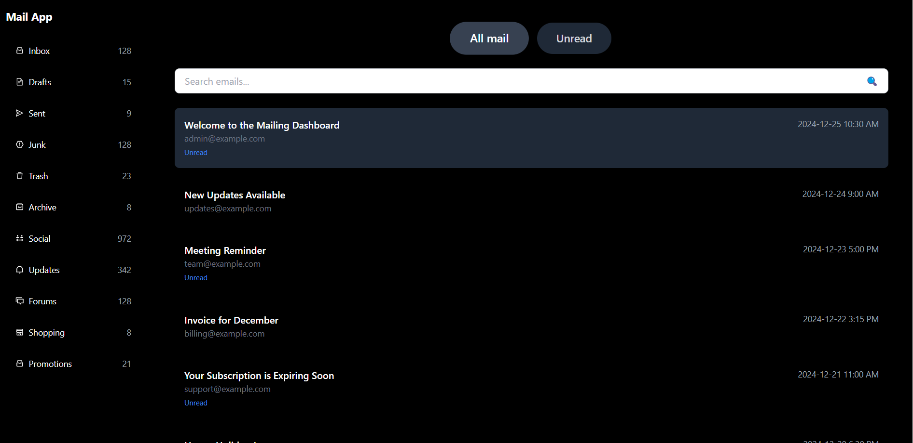
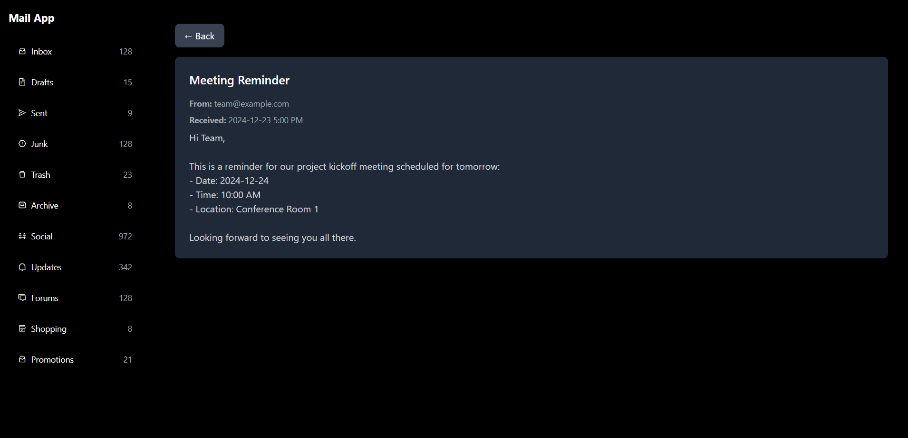

Here's the updated documentation with a deployed link and a section for project pictures:  

---

# Mailing Dashboard Application  

This project is a mailing dashboard built using **React.js** with features such as email listing, filtering, search, and navigation between login and the dashboard.  

---

## Features  

### **Login Page**  
- **Description:**  
  A simple login page with fields for email and password. Clicking the "Login" button directly navigates to the dashboard without validations for ease of demonstration.  
- **UI Highlights:**  
  - Gradient background for a visually appealing design.  
  - Responsive layout with a card-style login form.  
  - Clear call-to-action button for login.  

---

### **Dashboard Page**  
- **Key Features:**  
  - **Email Listing:**  
    Displays a list of emails with details such as subject, sender, timestamp, and content.  
  - **Tabs:**  
    - "All Mails" Tab: Shows all available emails.  
    - "Unread" Tab: Filters and displays only unread emails.  
  - **Search Functionality:**  
    - Search emails by subject or sender in real time.  
    - Fully responsive search input with a placeholder and focus effect.  
  - **Email Viewer:**  
    - Click on any email to view its full details, including content, sender, and timestamp.  
    - "Back" button to return to the email list.  

- **Mock Data:**  
  A set of pre-defined emails is used for the demonstration of functionality.  

---

## Deployed Link  

You can access the live application here:  
[Mailing Dashboard - Live](https://mailing-dashboard-qsqcms71a-farazakhter660s-projects.vercel.app/)  

---

## Project Pictures  

### **Login Page:**  
![Login Page]  

### **Dashboard - Email List:**  
![Email List]

### **Dashboard - Email Viewer:**  
![Email Viewer]

_Replace the placeholders with actual screenshots of your project._

---

## File Structure  

### **`src`**  
- `App.js`: Wraps the application with the `AuthProvider` context and renders the routing structure.  
- `router.js`: Contains the application's routing logic (not shown in this documentation, assumed implemented).  
- `contexts/AuthContext.js`: Provides authentication context for the app.  
- `styles/globals.css`: Contains TailwindCSS and global styles.  
- **Pages:**  
  - `Login.js`: The login page component.  
  - `Dashboard.js`: The main mailing dashboard component.  
- **Components:**  
  - `Sidebar.js`: Sidebar navigation (not described in detail here).  
  - `MailList.js`: Displays the list of filtered emails.  

---

## Installation & Setup  

1. **Clone the Repository:**  
   ```bash  
   git clone <repository-url>  
   cd <repository-folder>  
   ```  

2. **Install Dependencies:**  
   Ensure you have **Node.js** and **npm** installed, then run:  
   ```bash  
   npm install  
   ```  

3. **Start the Development Server:**  
   ```bash  
   npm start  
   ```  
   The application will be available at `http://localhost:3000`.  

---

## Usage Instructions  

1. Launch the app by navigating to the login page (`http://localhost:3000`).  
2. Enter any email and password (no validations required).  
3. Click the "Login" button to access the dashboard.  
4. Use the tabs to filter emails or the search bar to find specific ones.  
5. Click on an email to view its full content, and use the "Back" button to return to the list.  

---

## Technologies Used  
- **Frontend Framework:** React.js  
- **Styling:** TailwindCSS  
- **Routing:** React Router  
- **State Management:** React Context API  

---

## Future Enhancements  
- Add real authentication for login and logout.  
- Integrate a backend API for dynamic email data.  
- Improve UI accessibility and responsiveness.  
- Implement additional filters (e.g., date range, sender).  

---